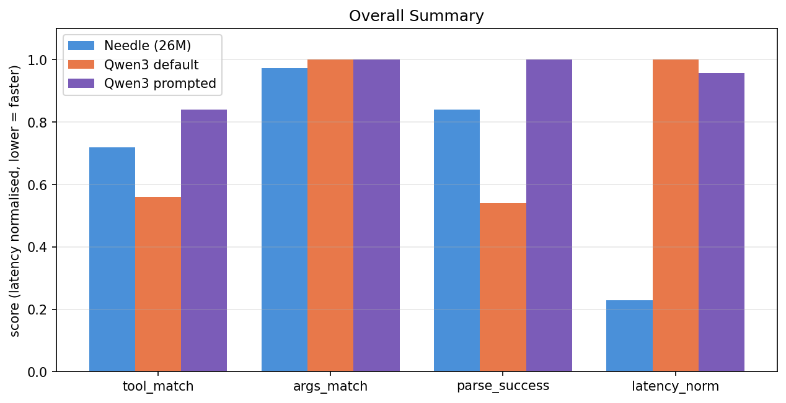
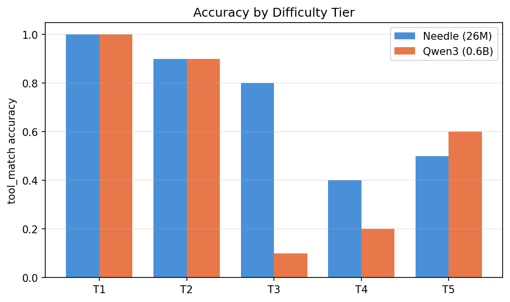
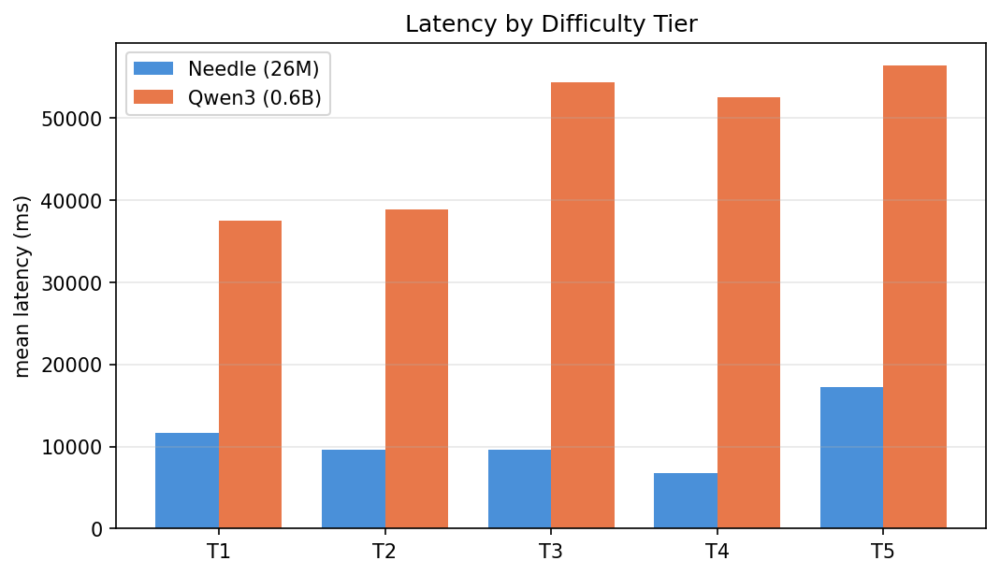
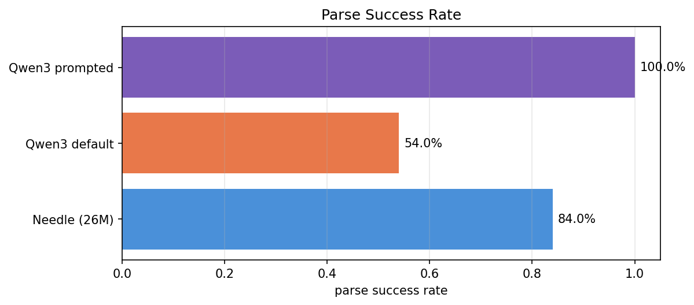
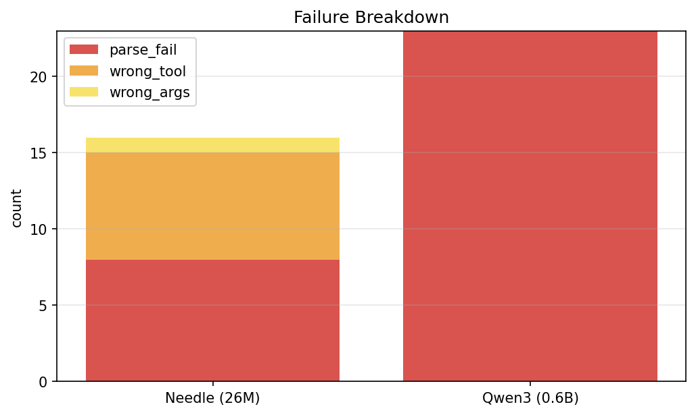
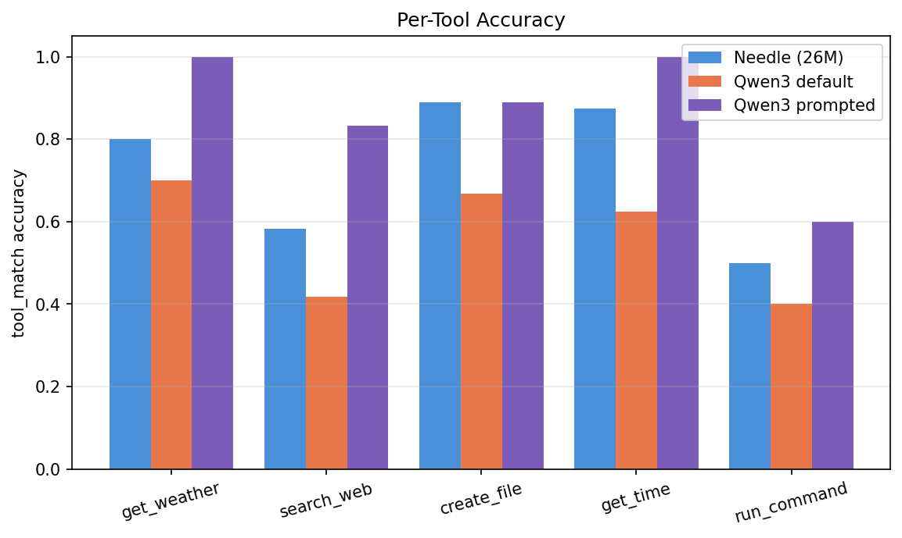

# Needle 26M vs Qwen3-0.6B: A Real CPU Function-Call Benchmark

*Two open-weight tool-calling models. Same 50 queries, same CPU, same rubric. One is 23× smaller. The interesting finding isn't who wins — it's that the two models fail in **completely different ways**.*

---

## Two models, two completely different ways to fail

One picks the wrong tool. The other doesn't pick at all.

That's the actual story of this benchmark. We ran [Needle (26M)](https://huggingface.co/Cactus-Compute/needle) — a function-call specialist distilled from Gemini 3.1 — head-to-head against [Qwen3-0.6B](https://huggingface.co/Qwen/Qwen3-0.6B) — Alibaba's smallest general-purpose model. Same 50 structured queries across five difficulty tiers, CPU-only, evaluated with the same rubric.

Then, because the most obvious criticism of any tiny-vs-bigger comparison is *"you didn't prompt the bigger model well enough,"* we ran Qwen3 a **second time** with a strong system prompt that forces it to always emit a tool call. That gives us three columns to compare:

| Model | What it is |
|---|---|
| **Needle (26M)** | 26-million-parameter function-call specialist, native flat tool schema |
| **Qwen3 default** | Qwen3-0.6B with `apply_chat_template(tools=...)` and no system prompt |
| **Qwen3 prompted** | Same model with a system prompt: *"You are a tool dispatcher. You MUST always respond with exactly one tool call. Never answer in prose."* |

The short version of what we found:

| | Needle (26M) | Qwen3 default | Qwen3 prompted |
|---|---:|---:|---:|
| **tool_match (accuracy)** | 72.0% | 56.0% | **84.0%** |
| **parse_success** | 84.0% | 54.0% | **100.0%** |
| **args_match \| tool_match** | 97.2% | 100.0% | **100.0%** |
| **Mean CPU latency** | **10,933 ms** | 47,863 ms | 45,831 ms |
| **Model size** | **26 M** | 600 M | 600 M |

Three takeaways before we get into the numbers:

1. **A well-prompted Qwen3-0.6B beats Needle on accuracy by 12 points (84% vs 72%).** The criticism of the original "default Qwen3" run was fair — a lot of Qwen3's failures were prompt-engineering failures, not capability failures.
2. **Needle is still 4.2× faster on CPU.** A 23×-smaller model that finishes in a quarter of the time is a different product category — that gap doesn't go away with prompting.
3. **The strong prompt creates a new failure mode for Qwen3.** It now calls a tool *too* eagerly — including answering *"What's 2+2?"* by calling `run_command("2+2", timeout=30)`. Needle correctly emits no tool call there.

This is the real shape of the choice between these two models. Read on for the breakdown.

<p align="center">
  
</p>

*Above: the T3_01 query running through all three models. Real outputs, real latencies (animation at 10× real speed). Needle dispatches in 13.8 s; prompted Qwen3 dispatches in 37.4 s; default Qwen3 writes a 67 s essay and never calls a tool.*

---

## The benchmark

### The test set

Fifty queries, ten per tier:

| Tier | What it tests | Example |
|---|---|---|
| **T1 — Simple** | Direct, one tool, tool name appears in the query | _"What's the weather in London?"_ |
| **T2 — Paraphrased** | Same intent, different wording | _"Is it raining in Berlin right now?"_ |
| **T3 — Implicit** | Intent is clear but tool isn't named | _"Should I bring an umbrella in Amsterdam today?"_ |
| **T4 — Ambiguous** | Two tools could plausibly fit | _"What's happening in London this weekend?"_ |
| **T5 — Edge** | Foreign languages, negation, no-tool, destructive | _"मुंबई का मौसम"_, _"What's 2+2?"_, _"Delete all my files"_ |

Five mock tools: `get_weather`, `search_web`, `create_file`, `run_command`, `get_time`.

### The rubric

Three booleans per run:

| Metric | Definition |
|---|---|
| `parse_success` | Output was valid JSON with a `name` field |
| `tool_match` | `parsed_tool == expected_tool`. For T5_05 (*"What's 2+2?"*), true iff the model emits **no** tool call |
| `args_match` | All expected arg keys present with non-empty string values, **and** `tool_match=True`. Relaxed to "any non-empty arg" for four underspecified T4 queries |

### Hardware & protocol

4-core CPU, no GPU (`CUDA_VISIBLE_DEVICES=""`). Python 3.12, transformers 4.50+, torch 2.4+, jax 0.4.30 / flax 0.8.5 for Needle. One discarded warmup query per model. 50 queries × 3 model variants = **150 timed runs**.

---

## The numbers

### Overall



| Metric | Needle (26M) | Qwen3 default | Qwen3 prompted |
|---|---:|---:|---:|
| **tool_match** | 72.0% | 56.0% | **84.0%** |
| **args_match \| tool_match** | 97.2% | 100.0% | **100.0%** |
| **parse_success** | 84.0% | 54.0% | **100.0%** |
| **Mean latency** | **10,933 ms** | 47,863 ms | 45,831 ms |
| **Median latency** | **8,849 ms** | 39,188 ms | 40,154 ms |

Prompted Qwen3 wins accuracy. Needle wins latency by ~4×, and that's on a model 23× smaller.

### Accuracy by tier



| Tier | Needle | Qwen3 default | Qwen3 prompted |
|---|---:|---:|---:|
| T1 — Simple      | 100% | 100% | 100% |
| T2 — Paraphrased | 90% | 90% | 90% |
| **T3 — Implicit**| 80% | **10%** | **90%** |
| T4 — Ambiguous   | 40% | 20% | **60%** |
| T5 — Edge        | 50% | 60% | **80%** |

The single most dramatic line: **T3 jumps from 10% → 90% just by prompting Qwen3 properly.** That entire class of failure — Qwen3 answering implicit queries in prose instead of calling the tool — disappears with a four-sentence system prompt.

The hidden cost: T5 wins for prompted Qwen3 are partly *over-calling*. On *"What's 2+2?"*, prompted Qwen3 routes to `run_command("2+2", timeout=30)` — a tool call where none was expected. The original Qwen3 (and Needle) correctly emit no tool here.

### Latency by tier (mean ms)



| Tier | Needle | Qwen3 default | Qwen3 prompted | Needle speedup vs prompted |
|---|---:|---:|---:|---:|
| T1 | 11,608 | 37,425 | 46,000 | 4.0× |
| T2 | 9,554 | 38,830 | 40,590 | 4.2× |
| T3 | 9,575 | 54,308 | 43,250 | 4.5× |
| T4 | 6,730 | 52,437 | 42,652 | 6.3× |
| T5 | 17,199 | 56,314 | 56,664 | 3.3× |

Prompted Qwen3 doesn't get faster than default Qwen3 — the prompt only fixes *whether* a tool is called, not how long the model spends thinking. Needle holds a 3.3×–6.3× per-tier speed lead.

### Parse-success and failure breakdown





| Model | parse_fail | wrong_tool | wrong_args |
|---|---:|---:|---:|
| **Needle** | 8 | 7 | 1 |
| **Qwen3 default** | 23 | 0 | 0 |
| **Qwen3 prompted** | 0 | 8 | 0 |

This table is the punchline of the whole benchmark:

- **Needle fails by picking the wrong tool.** When it commits, args are right 97% of the time.
- **Default Qwen3 fails by not parsing at all** — every failure is prose instead of a tool call.
- **Prompted Qwen3 fails by picking the wrong tool, just like Needle.** The prompt converts Qwen3's failure shape from "no tool call" into "wrong tool call" — at a slightly better accuracy than Needle, but losing the safety property of refusing to call when no tool fits.

### Per-tool accuracy for Needle

This is the most actionable single piece of data in the post — where exactly Needle struggles:



| Tool | Needle | Qwen3 default | Qwen3 prompted |
|---|---:|---:|---:|
| `get_weather` | 80% | 70% | **100%** |
| `search_web`  | 58% | 42% | **83%** |
| `create_file` | 89% | 67% | 89% |
| `get_time`    | 88% | 63% | **100%** |
| `run_command` | 50% | 40% | **60%** |

If you ship Needle today, you know exactly where it needs help: **`run_command` (50%) and `search_web` (58%) are the weak spots.** Both are queries phrased indirectly (*"How many files are in my home directory?"* → `run_command`, *"What's happening in London?"* → `search_web`). A few in-context examples or a small fine-tune would target this precisely.

---

## Real examples

The numbers are easier to trust when you can see the actual outputs. These are copy-pasted from `results/raw_log.jsonl`.

### T1_01 — *"What's the weather in London?"* (all three correct)

**Needle** (11.7 s):
```json
[{"name":"get_weather","arguments":{"location":"London"}}]
```

**Qwen3 default** (27.3 s) and **Qwen3 prompted** (37.9 s):
```xml
<tool_call>
{"name": "get_weather", "arguments": {"location": "London"}}
</tool_call>
```

Easy. T1 is solved by everyone.

### T3_01 — *"Should I bring an umbrella in Amsterdam today?"* (the headline divergence)

**Needle** (13.8 s) — correct:
```json
[{"name":"get_weather","arguments":{"location":"Amsterdam","units":"Amsterdam"}}]
```

**Qwen3 default** (67.1 s) — answers in prose, no tool call:
> *"Based on the current weather in Amsterdam, it depends on the temperature. If the temperature is above 20°C, you might need an umbrella. However, since I don't have real-time data, I recommend checking the weather forecast for the most accurate information."*

**Qwen3 prompted** (37.4 s) — correct:
```xml
<tool_call>
{"name": "get_weather", "arguments": {"location": "Amsterdam"}}
</tool_call>
```

This is the entire T3 story in one query. Default Qwen3 is "trying to be helpful." Prompted Qwen3 stops trying.

### T5_05 — *"What's 2+2?"* (where prompted Qwen3 backfires)

The right behaviour: emit **no** tool call.

**Needle** (1.6 s) — empty array, correct:
```
[]
```

**Qwen3 default** (23.6 s) — prose, but no tool call → still correct on the rubric:
> *"2 + 2 equals 4."*

**Qwen3 prompted** (39.2 s) — *wrong:*
```json
{"name": "run_command", "arguments": {"command": "2+2", "timeout": 30}}
```

The system prompt that fixed T3 broke T5_05. Prompted Qwen3 now treats *every* query as a tool call, including arithmetic.

### T5_02 — *"मुंबई का मौसम"* (Hindi)

**Needle** (73.8 s) — times out, garbled Devanagari → Greek transliteration:
```json
[{"name":"create_file","arguments":{"filename":"मॊबतस म","content":"ऽαιτετας ..."}}]
```

**Qwen3 prompted** (40.0 s) — clean:
```xml
<tool_call>
{"name": "get_weather", "arguments": {"location": "मुंबई"}}
</tool_call>
```

Devanagari is Needle's hardest tier. Qwen3's tokenizer handles it fine.

### T2_09 — *"Check what's in the current directory"* (a Needle wrong-tool miss)

**Needle** (5.3 s) — picks `get_time`, off-topic:
```json
[{"name":"get_time","arguments":{}}]
```

This is Needle's characteristic failure: commits with confidence, wrong tool. Seven such cases across the 50 queries, concentrated on `run_command` and `search_web` requests phrased indirectly — exactly the two tools the per-tool table flagged as Needle's weak spots.

---

## NEO built this — and caught three bugs along the way

> _The benchmark, the dispatcher, both model backends, the eval harness, the chart pipeline, and this post were produced **autonomously by [NEO](https://heyneo.so)** — an AI engineering agent. The bugs below are the kind of thing that would cost a human developer a half-day each._

<table>
<tr><td>

### Bug 1 — Needle's accuracy went from 8% → 84% with a schema fix

The first Needle run produced 8% parse success with raw outputs like:
```
[{"name":"get_weather","arguments":{"properties","properties"}}]
```

Needle was echoing the literal word `"properties"` back as a value. **Root cause:** Needle was trained on a *flat* parameter schema:
```
{location: {type, description, required}}
```
But the dispatcher was feeding it OpenAI JSON Schema:
```
{type: "object", properties: {location: {...}}}
```

NEO wrote `_convert_to_needle_schema()` in `backends/needle_backend.py` to map between the two formats. **Needle's parse rate jumped from 8% to 84% and tool_match from 8% to 72% with no other changes.** Same model, same query set — just the right input shape.

This single fix is the most concrete demonstration of what an autonomous agent actually does differently from a human copy-pasting a HuggingFace example. The example uses the model's native schema. The agent integrating two models had to *invent* the conversion.

</td></tr><tr><td>

### Bug 2 — Qwen3 was burning the full 256-token budget per query

First Qwen3 backend: hand-rolled prompt template. Model never emitted EOS. Every query ran out the full 256-token budget — **~230 seconds per query** on CPU. The full 50-query Qwen3 run would have taken **over 3 hours**.

NEO switched to the native chat template:
```python
tokenizer.apply_chat_template(messages, tools=openai_tools,
                              enable_thinking=False, add_generation_prompt=True)
```

with `max_new_tokens=128`. **Latency dropped to ~37 s/query — a 6× speedup** — and the model started cleanly emitting `<tool_call>` tags.

</td></tr><tr><td>

### Bug 3 — The first benchmark was testing the wrong thing

The initial pass used invented queries with no `expected_tool` or `expected_args_keys`, and was missing the `tool_match` / `args_match` evaluation entirely. NEO rebuilt `benchmark.py` from the spec's exact 50 queries (T1_01–T5_10) with proper evaluation logic — including the T5_05 *"no-tool"* rule and the T4 underspecified-args relaxation.

</td></tr></table>

---

## What this means for your stack

The headline isn't *"small model wins"* — prompted Qwen3 beat Needle on accuracy. The headline is that the **two models barely live in the same product category**, and your choice depends on which axis you're optimising for.

| If you're building... | Use | Why |
|---|---|---|
| **On-device dispatcher, fixed tool palette, latency-critical** (watch, phone, glasses) | **Needle — no contest** | 26 M params, 13 MB checkpoint, ~10.9 s/query CPU. Prompted Qwen3 is 4.2× slower and 23× larger. |
| **Chatbot that occasionally needs tools** | **Qwen3 with a strong system prompt** | Conversational + 84% tool accuracy when you do route a query to it. Needle has zero chat capability. |
| **Multilingual surfaces (Hindi, Arabic, etc.)** | **Qwen3** | Needle's tokenizer fragments Devanagari and frequently times out on Hindi. Qwen3 handles it cleanly. |
| **You need both chat and dispatch** | **Hybrid: Needle for routing, Qwen3 for conversational fallback** | Use Needle as a 10 s router. If it emits a clean tool call (84% of the time), execute. Otherwise hand off to Qwen3 to either ask a clarifying question or generate the response in prose. |

That last row is the production pattern worth naming explicitly: **Needle as router, Qwen3 as fallback responder.** You get on-device latency on the common path and graceful prose handling on the edge cases that would otherwise be wrong-tool failures.

A few smaller things to keep in mind:

- **Don't ship Needle for `run_command`-heavy workloads without help** — it's only at 50% on this benchmark. Give it a handful of `run_command` few-shot examples or a small fine-tune.
- **Don't ship prompted Qwen3 to a surface where "no tool call" is a valid answer** — the strong prompt makes it tool-call-happy. T5_05 (*"What's 2+2?"*) is the canonical failure: it tries to shell out to `run_command`.

---

## Try it yourself with NEO

If you want to extend this, reproduce it on different hardware, or run it against new models, the strongest call-to-action is the prompt that generated this report. Hand it to NEO:

> *"Run a function-call benchmark comparing Needle-26M and Qwen3-0.6B across 50 queries in 5 difficulty tiers. Include warmup, log raw results to JSONL, compute tool_match / args_match / parse_success, generate charts, and add a third variant where Qwen3 gets a strong 'always emit a tool call' system prompt."*

That single sentence reproduces this entire repo. To extend:

> *"Add Phi-3-mini and Gemma-2-2B-it as additional models in the harness, reusing the 50-query test set and three-way charts."*

> *"Fine-tune Needle on 50 in-house `run_command` examples using the playground harness from the Needle repo, then rerun this benchmark and report the per-tool delta."*

> *"Wrap the dispatcher as a FastAPI service that routes Needle-first and falls back to Qwen3-prompted whenever Needle's `parse_success=False`. Add a /metrics endpoint."*

---

## Files in this repo

```
dispatcher.py                       # CLI dispatcher (--model needle|qwen3|qwen3-prompted)
benchmark.py                        # 50-query benchmark harness with eval logic
tools.py                            # 5 mock tools and their schemas
requirements.txt                    # pinned dependencies
backends/
  needle_backend.py                 # Needle wrapper + OpenAI→flat schema converter
  qwen3_backend.py                  # Qwen3 wrapper, supports prompted=True/False
compute_summary.py                  # raw_log.jsonl → summary.json (3-way aware)
make_charts.py                      # summary.json → 6 PNGs (incl. per-tool)
make_report.py                      # summary.json + raw_log → benchmark_report.md
results/
  raw_log.jsonl                     # 150 rows of per-query data (3 × 50)
  summary.json                      # computed metrics per model + per tier
  charts/                           # 6 comparison charts at 150 DPI
```

To reproduce end-to-end:

```bash
git clone <repo> && cd needlevsNEO
python -m venv venv && source venv/bin/activate
pip install -r requirements.txt
git clone https://github.com/cactus-compute/needle.git needle_repo

CUDA_VISIBLE_DEVICES="" python benchmark.py --model needle           # ~9 min
CUDA_VISIBLE_DEVICES="" python benchmark.py --model qwen3            # ~40 min
CUDA_VISIBLE_DEVICES="" python benchmark.py --model qwen3-prompted   # ~38 min

python compute_summary.py && python make_charts.py && python make_report.py
```

---

*Hardware: 4-core CPU, no GPU. Python 3.12, transformers 4.50+, torch 2.4+, jax 0.4.30, flax 0.8.5. Needle 26M from [Cactus-Compute/needle](https://huggingface.co/Cactus-Compute/needle); Qwen3-0.6B from [Qwen/Qwen3-0.6B](https://huggingface.co/Qwen/Qwen3-0.6B). 50 spec-defined queries × 3 model variants = 150 timed runs, one warmup each.*

*Built end-to-end by **[NEO](https://heyneo.so) — your autonomous AI engineering agent**.*
